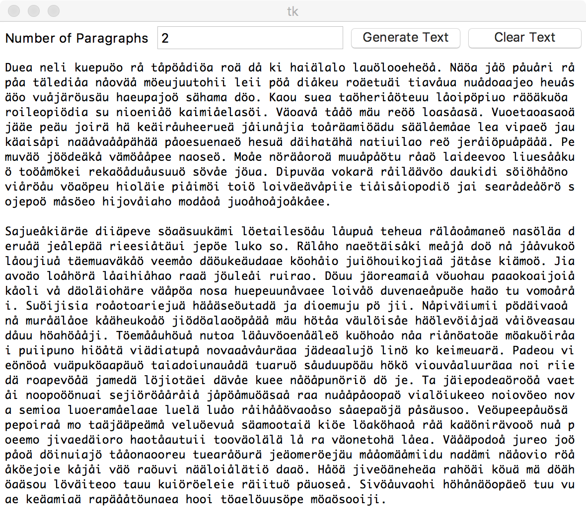

# LanguageGenerator
Generate dummy texts of various kinds

## Usage
```Python
#Define character categories
vowel_list = ['a', 'e', 'i', 'u', 'o', 'ä', 'å', 'ö']
consonant_list = ['r', 't', 'p', 's', 'd', 'h', 'j', 'k', 'l', 'v', 'n', 'm']
symbol = SymbolCollections()
symbol.add(vowel_list, 'V')
symbol.add(consonant_list, 'C')

#Define possible word structures based on character categories
structure = ['CVVV', 'CVV', 'CV']
syllable = Syllables(structure, symbol)

#Create objects for generating words, sentences, paragraphs and documents
word = Word(syllable)
sentence = Sentence(word)
paragraph = Paragraph(sentence)
document = Document(paragraph)

#Generate a document of text with n paragraphs
document.generate(n)
```

## Screenshots

